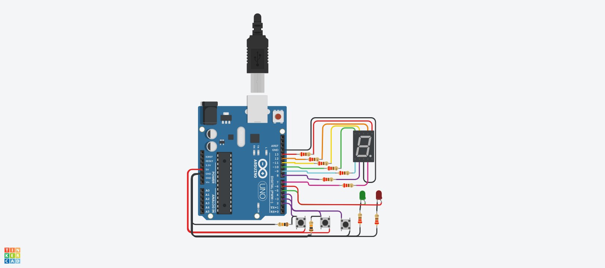
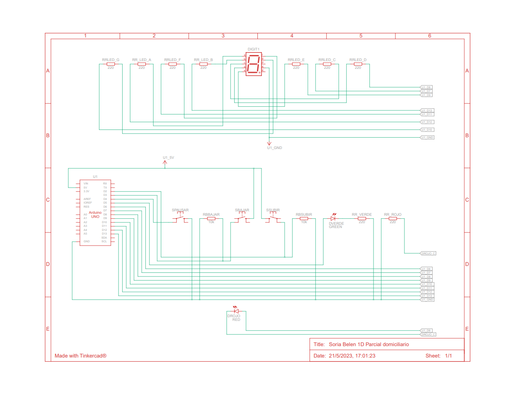

# Primer parcial

## Integrante
- Belen Soria

## Practica domiciliaria: Sistema Montacargas.
 

## Sistema Montacargas: diagrama esquemático.

### Componentes

• 3 botones, uno para subir pisos, otro para bajar pisos y otro para detener el montacarga.
• 2 LEDs, uno verde que indicará cuando el montacarga este en movimiento, otro rojo que indique cuando el montacarga esté pausado.
• Un display 7 segmentos el cual deberán informar en tiempo real en qué piso se encuentra el elevador.

### requisitos
• Se sabe que el tiempo de trayecto entre pisos es de 3 segundos (3000 ms).
• Se deberá informar por monitor serial el piso en el que se encuentra el montacarga, este en funcionamiento o en pausa.

## Descripción
Mi proyecto es un modelo de montacarga funcional para un hospital.
Este posee un sistema que puede recibir ordenes de subir, bajar o pausar desde diferentes pisos y
muestra el estado actual del montacargas en el display 7 segmentos.

## Función principal

Esta funcion se encarga de ejecutar el display cada 3 segundos. Y permite que se pueda leer el estado de los botones.

actual y anterior son variables locales que representan a variables globales, las cuales almacenan el tiempo actual 
contadorSistemaDisplay, estadoSistema también son variables globales que se encargan de cambiar el numero en el display.

Esta funcion toma el tiempo actual y le resta el tiempo anterior desde que se ejecutó, si es menor al intervalo de tiempo
entre cada piso lo muestra por el display incrementandolo.
Dicho anteriormente, esta función permite que los botones puedan ser leídos simultaneamente usando la funcion millis.

~~~ C (lenguaje en el que esta escrito)

void EjecutarDisplay(int *actual, int *anterior, int intervalo)
{
  if (*actual - *anterior> intervalo)
  {
    Serial.print("Estado actual montacarga: piso: ");
    contadorSistemaDisplay = contadorSistemaDisplay + estadoSistema;
    
    if(contadorSistemaDisplay > 9)
    { 
      contadorSistemaDisplay = 9;
      estadoSistema = 0;
    }
    else
    {
      if(contadorSistemaDisplay < 0)
      {
        Serial.println("Presione: subir");
        contadorSistemaDisplay = 0;
        estadoSistema = 0;
      }
    }
  	Serial.println(contadorSistemaDisplay);
    
    MostrarNumeroDisplay(contadorSistemaDisplay, estadoSistema);
    
    *anterior = millis();
  }
}
~~~

## Funciones 
Explicacion funcion a funcion sobre el código.

### Función loop
En la funcion loop tenemos el llamado a las funciones

LED_VERDE, LED_ROJO, BOTONSUBIR, BOTONBAJAR, BOTONPAUSAR, son define que se utilizan para agregar los botones y
 los leds asociandolos a pines de la placa arduino.
INTERVALODISPLAY wa una constante que representa el tiempo entre cada piso
la variable actualMillis toma, mediante la funcion millis() el timepo actual.

~~~ C (lenguaje en el que esta escrito)
void loop()
{
  actualMillis =  millis();
  PrenderLedPrimero(LED_VERDE);
  
  VerificarBoton(BOTONSUBIR,LED_VERDE, LED_ROJO, 1 , "subiendo" );
  VerificarBoton(BOTONBAJAR,LED_VERDE, LED_ROJO, -1 , "bajando" );
  VerificarBotonPausar(BOTONPAUSAR,LED_VERDE, LED_ROJO);
  
  EjecutarDisplay(&actualMillis, &anteriorMillis, INTERVALODISPLAY);
}
~~~

### VerificarBoton 
Esta funcion se encarga de verificar el bonton enviado como parametro, si el pulso del boton es 1 informa el estado del montecarga
junto al mensaje enviado como parametro, es decir, subiendo o bajando.
A a la vez guarda en la variable estadoSistema el numero que que reseprenta si se va a incrementar o decrecer o manternerse en pausa.

~~~ C (lenguaje en el que esta escrito)
void VerificarBoton(int boton, int ledPrendido, int ledPausado, int estado, String mensaje)
{
  int lectura = digitalRead(boton);
  if(lectura == HIGH)
  {
   Serial.print("Estado actual montacarga: ");
   Serial.println(mensaje);
   estadoSistema = estado;
    
   estadoSistemaAnterior = estadoSistema;
   contadorPausar = 0;
    
   digitalWrite(ledPrendido, HIGH);
   digitalWrite(ledPausado, LOW);
  }
}
~~~

### VerificarBotonPausar

Esta funcion se encarga de verificar el bonton de pausar que es enviado como parametro, si el pulso del boton es 0 informa el estado del montecargas
junto al mensaje enviado como parametro, es decir, subiendo o bajando.
A a la vez guarda en la variable estadoSistema el numero que que reseprenta si se va a incrementar o decrecer o manternerse en pausa, el sistema.

~~~ C (lenguaje en el que esta escrito)
void VerificarBotonPausar(int boton, int ledPrendido, int ledPausado)
{
  lecturaPausar = digitalRead(boton);
  if (lecturaPausar != ultimaLecturaPausar)
  {
    if (lecturaPausar == LOW)
    {
      contadorPausar++;
      Serial.print("Contador de boton pausado: ");
      Serial.println(contadorPausar);
    }
    if(contadorPausar %2 == 0)
      {
        estadoSistema = estadoSistemaAnterior;
      	digitalWrite(ledPrendido, HIGH);
        digitalWrite(ledPausado, LOW);
      }
      else
      {
        estadoSistema = 0;
        Serial.println("Estado actual montacarga: pausado.");
        digitalWrite(ledPrendido, LOW);
        digitalWrite(ledPausado, HIGH);
      }
    delay(50);
  }
  ultimaLecturaPausar = lecturaPausar;
}
~~~

### MostrarNumeroDisplay

Esta funcion se encarga de mostrar el numero  o los leds prendidos del display 7 segmentos, enviando el estado a otra funcion
la variable contador es el que indica que numero se va mostrar.
~~~ C (lenguaje en el que esta escrito)
void MostrarNumeroDisplay(int contador, int estadoSistema)
{
  switch (contador)
  {
    case 0:
      Serial.println("Estado actual montacargas: planta baja.");
      MostrarNumero(HIGH,HIGH,HIGH,HIGH,HIGH,HIGH,LOW);
    break;
    
    case 1:
      MostrarNumero(LOW,HIGH,HIGH,LOW,LOW,LOW,LOW);
    break;
    
    case 2:
      MostrarNumero(HIGH,HIGH,LOW,HIGH,HIGH,LOW,HIGH);
    break;
    
    case 3:
      MostrarNumero(HIGH,HIGH,HIGH,HIGH,LOW,LOW,HIGH);
    break;
    
    case 4:
	  MostrarNumero(LOW,HIGH,HIGH,LOW,LOW,HIGH,HIGH);
    break;
    
    case 5:
      MostrarNumero(HIGH,LOW,HIGH,HIGH,LOW,HIGH,HIGH);
    break;
    
    case 6:
      MostrarNumero(HIGH,LOW,HIGH,HIGH,HIGH,HIGH,HIGH);
    break;

    case 7:
      MostrarNumero(HIGH,HIGH,HIGH,LOW,LOW,LOW,LOW);
    break;

    case 8:
      MostrarNumero(HIGH,HIGH,HIGH,HIGH,HIGH,HIGH,HIGH);
    break;
    
    case 9:
      MostrarNumero(HIGH,HIGH,HIGH,HIGH,LOW,HIGH,HIGH);
      Serial.println("Estado actual montacargas: ultimo piso. Presione: bajar");
    break;
  }
}
~~~

### MostrarNumero
Esta funcion se encarga de encender y apagar los leds del display 7 segmentos

~~~ C (lenguaje en el que esta escrito)
//Enciende cada led del display dependiendo el estado que recibe
void MostrarNumero(int estadoA, int estadoB,int estadoC, int estadoD, int estadoE, int estadoF, int estadoG)
{
  digitalWrite(LED_A, estadoA);
  digitalWrite(LED_B, estadoB);
  digitalWrite(LED_C, estadoC);
  digitalWrite(LED_D, estadoD);
  digitalWrite(LED_E, estadoE);
  digitalWrite(LED_F, estadoF);
  digitalWrite(LED_G, estadoG);
}
~~~
## :robot: Link al proyecto
- [proyecto](https://www.tinkercad.com/things/bMnZ0p5rvni)
## :tv: Link al video del proceso

---

